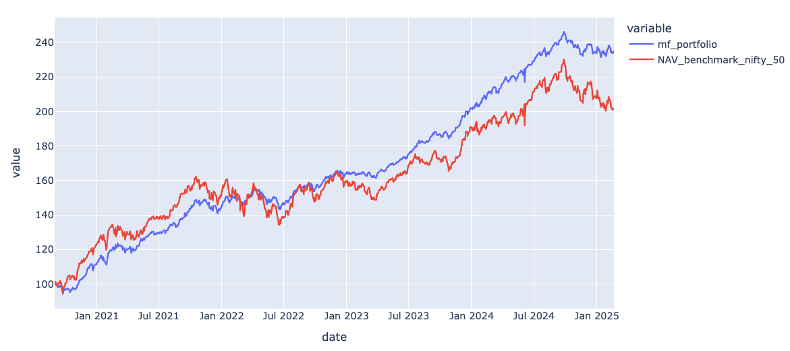

# Hybrid Mutual Funds Portfolio Analysis

## Overview
This analysis focuses on creating an optimized portfolio using various categories of Hybrid Mutual Funds in India. We selected the top 5 funds based on Assets Under Management (AUM) for each type of Hybrid Mutual Fund, then applied a portfolio optimization algorithm to select one fund from each category.

> **Note:** All analysis was performed on Direct Growth Funds only.

## Data Source
- [AMFI - Association of Mutual Funds in India](https://www.amfiindia.com/net-asset-value/nav-history)

## Optimized Portfolio Recommendation
| Mutual Fund | Category | Allocation |
|:------------|:--------:|----------:|
| ICICI Prudential Equity & Debt Fund | Aggressive Hybrid | 30% |
| Invesco India Arbitrage Fund | Arbitrage | 10% |
| ICICI Prudential Regular Savings Fund | Conservative Hybrid | 10% |
| ICICI Prudential Equity Savings Fund | Equity Savings | 10% |
| ICICI Prudential Multi Asset Fund | Multi Asset | 40% |

## Portfolio Performance (Sept 2020 - Feb 2025)

## Performance Metrics
The following metrics were calculated based on a risk-free interest rate of 6% using data from September 2020 to February 2025:

| Metric | Portfolio | NIFTY 50 Benchmark |
|:-------|----------:|-------------------:|
| Sharpe Ratio | 1.602 | 0.737 |
| Sortino Ratio | 2.006 | 0.987 |
| CAGR | 21.0% | 16.9% |
| Risk-Adjusted Returns | 2.505 | 1.167 |
| Risk-Adjusted Returns (Downside) | 3.136 | 1.563 |

The portfolio significantly outperforms the NIFTY 50 benchmark across all key performance metrics, demonstrating superior risk-adjusted returns and downside protection.

## Category Analysis

### Aggressive Hybrid Funds

| Fund Name | AUM (₹) | Expense Ratio | Exit Load |
|:----------|:-------:|:-------------:|:----------|
| SBI Equity Hybrid Fund | 71,142.58 Cr | 0.73% | For exit within 12 months:  - First 10% of investment: Nil - Remaining: 1.00% After 12 months: Nil |
| ICICI Prudential Equity & Debt Fund | 39,886.28 Cr | 1.02% | Within 1 Year: - Up to 30% of units: Nil - Above 30% of units: 1% of NAV After 1 Year: Nil |
| HDFC Hybrid Equity Fund | 23,353.84 Cr | 1.05% | Within 1 Year: - Up to 15% of units: Nil - Above 15% of units: 1.00% After 1 Year: Nil |
| DSP Aggressive Hybrid Fund | 10,137.49 Cr | 0.71% | Within 12 months: - Up to 10% of units: Nil - Above 10% of units: 1% After 12 months: Nil |
| Canara Robeco Equity Hybrid Fund | 10,108.21 Cr | 0.64% | Within 1 Year: - Up to 10% of units: Nil - Above 10% of units: 1% After 1 Year: Nil |

### Arbitrage Funds

| Fund Name | AUM (₹) | Expense Ratio | Exit Load |
|:----------|:-------:|:-------------:|:----------|
| Kotak Equity Arbitrage Fund | 57,567.02 Cr | 0.43% | Within 30 days: 0.25% After 30 days: Nil |
| SBI Arbitrage Opportunities Fund | 32,168.95 Cr | 0.41% | Within 1 Month: 0.25% After 1 Month: Nil |
| ICICI Prudential Equity - Arbitrage Fund | 25,324.33 Cr | 0.39% | Within 1 Month: 0.25% of NAV After 1 Month: Nil |
| Invesco India Arbitrage Fund | 18,673.68 Cr | 0.39% | Within 15 Days: 0.50% After 15 Days: Nil |
| HDFC Arbitrage Fund - Wholesale Plan | 17,654.29 Cr | 0.41% | Within 1 Month: 0.25% After 1 Month: Nil |

### Conservative Hybrid Funds

| Fund Name | AUM (₹) | Expense Ratio | Exit Load |
|:----------|:-------:|:-------------:|:----------|
| SBI Conservative Hybrid Fund | 9,760.98 Cr | 1.05% | Within 1 Year: - First 10% of investment: Nil - Remaining: 1.00% After 1 Year: Nil |
| HDFC Hybrid Debt Fund | 3,274.19 Cr | 1.19% | Within 1 Year: - Up to 15% of units: Nil - Above 15% of units: 1.00% After 1 Year: Nil |
| ICICI Prudential Regular Savings Fund | 3,126.74 Cr | 0.97% | Within 1 Year: - Up to 30% of units: Nil - Above 30% of units: 1% of NAV After 1 Year: Nil |
| Kotak Debt Hybrid Fund | 3,051.69 Cr | 0.45% | Within 6 Months: - Up to 8% of initial investment: Nil - Above 8% of initial investment: 1% After 6 Months: Nil |
| UTI Conservative Hybrid Fund | 1,632.94 Cr | 1.18% | Within 1 Year: - Up to 10% of units: Nil - Above 10% of units: 1.00% After 1 Year: Nil |

### Equity Savings Funds

| Fund Name | AUM (₹) | Expense Ratio | Exit Load |
|:----------|:-------:|:-------------:|:----------|
| ICICI Prudential Equity Savings Fund | 12,788.49 Cr | 0.45% | Within 7 Days: - Up to 10% of units: Nil - Above 10% of units: 0.25% of NAV After 7 Days: Nil |
| Kotak Equity Savings Fund | 8,176.82 Cr | 0.65% | Within 90 Days: - Up to 8% of initial investment: Nil - Above 8% of initial investment: 1% After 90 Days: Nil |
| SBI Equity Savings Fund | 5,705.20 Cr | 0.88% | Within 15 Days: 0.10% After 15 Days: Nil |
| HDFC Equity Savings Fund | 5,584.43 Cr | 0.91% | Within 30 Days: - Up to 15% of units: Nil - Above 15% of units: 1.00% After 30 Days: Nil |
| DSP Equity Savings Fund | 2,417.24 Cr | 0.43% | Nil |

### Multi Asset Funds

| Fund Name | AUM (₹) | Expense Ratio | Exit Load |
|:----------|:-------:|:-------------:|:----------|
| ICICI Prudential Multi Asset Fund | 52,760.77 Cr | 0.70% | Within 1 Year: - Up to 30% of units: Nil - Above 30% of units: 1% of NAV After 1 Year: Nil |
| SBI Multi Asset Allocation Fund | 7,140.71 Cr | 0.53% | Within 1 Year: - First 10% of investment: Nil - Remaining: 1.00% After 1 Year: Nil |
| UTI Multi Asset Allocation Fund | 5,078.64 Cr | 0.41% | Within 30 Days: 1% After 30 Days: Nil |
| Nippon India Multi Asset Allocation Fund | 5,001.93 Cr | 0.30% | Within 12 Months: - First 10% of units: Nil - Remaining units: 1% (FIFO basis) After 12 Months: Nil |
| HDFC Multi Asset Fund | 3,892.70 Cr | 0.79% | Within 1 Year: - Up to 15% of units: Nil - Above 15% of units: 1.00% After 1 Year: Nil |